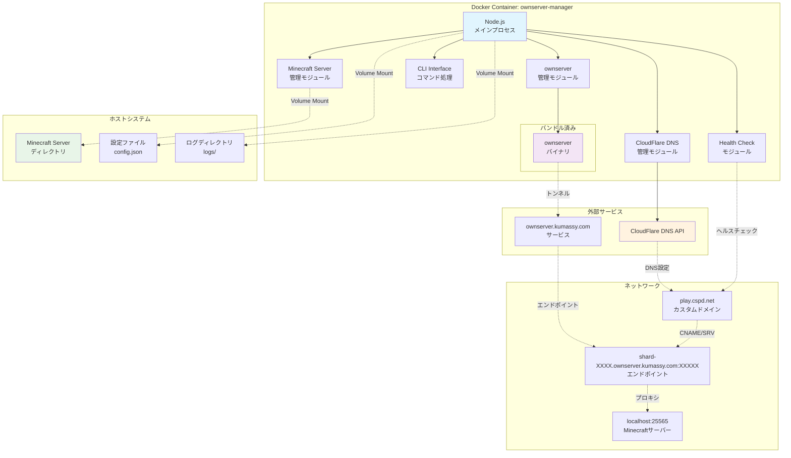

## 概要

ownserver-managerは、Minecraftサーバーの自動公開とDDNS管理を行うNode.js製のツールです。Dockerコンテナ内でMinecraftサーバーとownserverを管理し、CloudFlare DNS APIを通じて動的なドメイン設定を自動化します。

## 技術スタック

- **Runtime**: Node.js 24 (Alpine Linux)
- **Container**: Docker + Docker Compose
- **Java Runtime**: OpenJDK 複数バージョン (Minecraft Server用)
- **外部ツール**: ownserver (Rust製、バンドル済み)
- **DNS Provider**: CloudFlare DNS API
- **Process Management**: Node.js Child Process
## 概念図



## アーキテクチャ

### コンポーネント構成

|コンポーネント|責務|実装方式|
|---|---|---|
|**Main Process**|全体の制御・イベント調整|Node.js EventEmitter|
|**Minecraft Manager**|Minecraftサーバー管理|Child Process (Java)|
|**OwnServer Manager**|ownserver管理・エンドポイント取得|Child Process (Rust Binary)|
|**CloudFlare Manager**|DNS API操作・レコード管理|HTTP REST API|
|**Health Checker**|接続監視・自動復旧|TCP Socket + Timer|
|**CLI Interface**|コマンド処理・操作インターフェース|Commander.js|

### データフロー

1. **起動フロー**
    - Minecraft Server起動 → ownserver起動 → エンドポイント取得 → DNS設定
2. **監視フロー**
    - 定期ヘルスチェック → 障害検出 → 自動復旧処理
3. **終了フロー**
    - DNS削除 → ownserver停止 → Minecraft Server停止

## 機能仕様

### 1. Minecraftサーバー管理

#### 機能一覧

- ✅ 指定ディレクトリからのサーバー起動
- ✅ サーバーコンソールへのコマンド送信
- ✅ ログリアルタイム監視
- ✅ グレースフル停止・強制停止
- ✅ 自動再起動（異常終了時）

#### 実装詳細

JavaScript

```
// 起動例
const minecraft = new MinecraftServerManager('/app/minecraft-servers/survival', config);
await minecraft.start();

// コマンド送信
await minecraft.sendCommand('say Server is online!');

// イベント処理
minecraft.on('log', (data) => console.log(data.message));
minecraft.on('started', () => console.log('Minecraft server started'));
minecraft.on('stopped', (code) => console.log(`Server stopped with code: ${code}`));
```

#### 設定パラメータ

- **serverDirectory**: Minecraftサーバーのディレクトリパス
- **javaArgs**: JVMオプション（メモリ設定等）
- **autoRestart**: 異常終了時の自動再起動
- **restartDelay**: 再起動までの待機時間

### 2. ownserver管理

#### 機能一覧

- ✅ ownserverプロセス起動・停止
- ✅ エンドポイント情報の自動抽出
- ✅ ログ監視・解析
- ✅ 接続エラー時の自動復旧

#### エンドポイント抽出

ownserverの標準出力から以下の形式でエンドポイントを抽出：

Code

```
Endpoint Info:
+-------------------------------------------------------------------------+
| tcp://localhost:25565 <--> tcp://shard-2509.ownserver.kumassy.com:15440 |
+-------------------------------------------------------------------------+
```

抽出結果: `shard-2509.ownserver.kumassy.com:15440`

#### 実装例

JavaScript

```
const ownserver = new OwnServerManager();
const endpoint = await ownserver.start(25565);
console.log(`Endpoint: ${endpoint}`); // shard-xxxx.ownserver.kumassy.com:xxxxx
```

### 3. CloudFlare DNS管理

#### API操作

- **CNAMEレコード作成**: カスタムドメイン → ownserverホスト
- **SRVレコード作成**: Minecraft SRV (_minecraft._tcp)
- **レコード削除**: サーバー停止時のクリーンアップ
- **TTL管理**: 迅速な切り替えのための短縮TTL

#### DNS設定例

JavaScript

```
// CNAME: play.cspd.net → shard-2509.ownserver.kumassy.com
// SRV: _minecraft._tcp.play.cspd.net → shard-2509.ownserver.kumassy.com:15440
```

#### 実装詳細

JavaScript

```
const cloudflare = new CloudFlareManager(apiToken, zoneId);

// DNS設定適用
await cloudflare.setMinecraftDNS('play.cspd.net', 'shard-2509.ownserver.kumassy.com:15440');

// DNS削除
await cloudflare.removeMinecraftDNS('play.cspd.net');
```

### 4. ヘルスチェック機能

#### 監視項目

- **TCP接続**: カスタムドメインからMinecraftサーバーへの到達性
- **応答時間**: 接続タイムアウトの監視
- **連続失敗**: 閾値を超えた場合の復旧処理

#### 復旧アクション

1. ownserver再起動
2. DNS設定再適用
3. 問題継続時はMinecraftサーバー再起動

#### 設定例

JSON

```
{
  "healthcheck": {
    "enabled": true,
    "interval": 30000,    // 30秒間隔
    "timeout": 5000,      // 5秒タイムアウト
    "retries": 3,         // 3回失敗で復旧処理
    "actions": ["restart_ownserver", "restart_minecraft"]
  }
}
```

## コマンドインターフェース

### CLIコマンド仕様

|コマンド|説明|実行例|
|---|---|---|
|`mc <command>`|Minecraftサーバーコンソールにコマンド送信|`mc "say Hello World"`|
|`restart all`|全サービス再起動|`restart all`|
|`restart mc`|Minecraftサーバーのみ再起動|`restart mc`|
|`restart own`|ownserver再起動 + DNS再設定|`restart own`|
|`private`|サーバー非公開（ownserver停止 + DNS削除）|`private`|
|`public`|サーバー公開（ownserver起動 + DNS設定）|`public`|
|`stop`|全停止 + プログラム終了|`stop`|
|`status`|各サービスの状態表示|`status`|
|`logs`|ログ表示（リアルタイム）|`logs --follow`|

### 使用例

bash

```
# Docker Compose経由でコマンド実行
docker-compose exec ownserver-manager node src/commands/cli.js public
docker-compose exec ownserver-manager node src/commands/cli.js mc "weather clear"
docker-compose exec ownserver-manager node src/commands/cli.js status
```

## 設定管理

### 環境変数

bash

```
# CloudFlare API設定
CLOUDFLARE_API_TOKEN=your_api_token_here
CLOUDFLARE_ZONE_ID=your_zone_id_here

# アプリケーション設定
NODE_ENV=production
MINECRAFT_SERVER_DIR=/app/minecraft-servers
CONFIG_PATH=/app/config/config.json
LOG_LEVEL=info
```

### 設定ファイル構造

JSON

```
{
  "minecraft": {
    "serverDirectory": "/app/minecraft-servers/survival",
    "port": 25565,
    "javaArgs": ["-Xmx2G", "-Xms1G"],
    "autoRestart": true,
    "restartDelay": 5000
  },
  "ownserver": {
    "binaryPath": "/app/bin/ownserver",
    "autoRestart": true,
    "restartDelay": 3000
  },
  "cloudflare": {
    "domain": "play.cspd.net",
    "ttl": 60
  },
  "healthcheck": {
    "enabled": true,
    "interval": 30000,
    "timeout": 5000,
    "retries": 3
  }
}
```

## ログ管理

### ログカテゴリ

- **minecraft.log**: Minecraftサーバーのログ
- **ownserver.log**: ownserverのログ
- **manager.log**: ownserver-manager自体のログ
- **dns.log**: CloudFlare API操作ログ
- **healthcheck.log**: ヘルスチェック結果

### ログローテーション

- **最大ファイルサイズ**: 10MB
- **保持ファイル数**: 5ファイル
- **圧縮**: gzip圧縮
- **ログレベル**: debug, info, warn, error

## ボリュームマウント

### Docker Compose設定

YAML

```
volumes:
  - ./minecraft-servers:/app/minecraft-servers  # Minecraftサーバーディレクトリ
  - ./config:/app/config                        # 設定ファイル
  - ./logs:/app/logs                           # ログディレクトリ
  - ./backups:/app/backups                     # バックアップディレクトリ（オプション）
```

### ディレクトリ構造

Code

```
host-directory/
├── minecraft-servers/           # Minecraftサーバー群
│   ├── survival/               # サバイバルサーバー
│   │   ├── server.jar
│   │   ├── server.properties
│   │   ├── world/
│   │   └── plugins/
│   └── creative/               # クリエイティブサーバー
├── config/
│   ├── config.json
│   └── docker.env
├── logs/
│   ├── minecraft.log
│   ├── ownserver.log
│   └── manager.log
└── backups/                    # 自動バックアップ（今後実装予定）
```

## エラーハンドリング

### エラーカテゴリと対応

|エラー種別|原因|自動復旧|手動対応|
|---|---|---|---|
|**Minecraft起動失敗**|server.jar不存在、ポート使用中|❌|設定確認・ファイル配置|
|**ownserver起動失敗**|バイナリ不存在、権限不足|⚠️ (3回まで)|バイナリ確認・権限修正|
|**DNS API失敗**|トークン無効、レート制限|⚠️ (指数バックオフ)|トークン更新・待機|
|**接続性エラー**|ネットワーク障害、サービス停止|✅ (自動再起動)|ネットワーク確認|
|**設定エラー**|不正なJSON、必須項目不足|❌|設定ファイル修正|

### 復旧戦略

1. **段階的復旧**: ownserver → DNS → Minecraft server
2. **指数バックオフ**: 連続失敗時の待機時間増加
3. **フェイルファスト**: 設定エラー等は即座に停止
4. **ログ出力**: 全エラーを詳細ログに記録

## パフォーマンス考慮事項

### リソース使用量

- **CPU**: Node.js (低負荷) + Java (Minecraftサーバー依存)
- **メモリ**: Node.js (~50MB) + Java (設定可能、推奨2GB+)
- **ディスク**: ログローテーション、Minecraftワールドデータ
- **ネットワーク**: DNS API (軽微)、ownserverトンネル

### 最適化ポイント

- **Java GC調整**: Minecraftサーバーの応答性向上
- **ログレベル調整**: 本番環境ではinfo以上に制限
- **ヘルスチェック間隔**: 負荷とレスポンス性のバランス
- **DNS TTL**: 切り替え速度と負荷のトレードオフ

## セキュリティ考慮事項

### アクセス制御

- **非rootユーザー実行**: Dockerコンテナ内でnodejsユーザー使用
- **API トークン管理**: 環境変数での秘匿情報管理
- **ファイル権限**: 設定ファイル・ログの適切な権限設定

### ネットワークセキュリティ

- **ファイアウォール**: 必要ポート（25565）のみ公開
- **HTTPS**: CloudFlare API通信の暗号化
- **DNS検証**: 設定前のドメイン所有確認

## 運用・保守

### 監視項目

- **プロセス生存**: Minecraft・ownserver・manager
- **メモリ使用量**: Java heap、Node.js memory
- **ディスク使用量**: ログ・ワールドデータ
- **ネットワーク接続性**: エンドポイント到達性

### バックアップ戦略（今後実装予定）

- **ワールドデータ**: 定期的な自動バックアップ
- **設定ファイル**: Git管理推奨
- **ログアーカイブ**: 長期保存用の圧縮・移動

### アップデート手順

1. **設定バックアップ**
2. **サービス停止**: `docker-compose down`
3. **イメージ更新**: `docker-compose pull`
4. **起動・動作確認**: `docker-compose up -d`